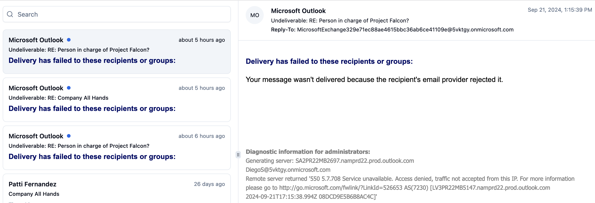

<!-- TOC -->
* [Overview](#overview)
* [Setup](#setup)
  * [Recommended IDE Setup](#recommended-ide-setup)
  * [Type Support for `.vue` Imports in TS](#type-support-for-vue-imports-in-ts)
  * [Customize configuration](#customize-configuration)
* [Build, Test and Run](#build-test-and-run)
  * [Install Dependencies](#install-dependencies)
  * [Environment Variables](#environment-variables)
  * [Run Locally](#run-locally)
  * [Type-Check, Compile and Minify for Production](#type-check-compile-and-minify-for-production)
  * [Run Unit Tests with Vitest](#run-unit-tests-with-vitest)
  * [Run End-to-End Tests with Playwright](#run-end-to-end-tests-with-playwright)
  * [Lint with ESLint](#lint-with-eslint)
  * [Format with Prettier](#format-with-prettier)
* [To Do](#to-do)
<!-- TOC -->

# Overview

Building an MS Exchange email client using:
* [`shadcn-vue`](https://www.shadcn-vue.com/)
* [Microsoft Graph API](https://developer.microsoft.com/en-us/graph)

This is based on the [`shadcn-vue` Mail example](https://www.shadcn-vue.com/examples/mail.html).  
The code for that example is located [here](https://github.com/radix-vue/shadcn-vue/tree/dev/apps/www/src/examples/mail).

Since the [Microsoft Graph JavaScript Client Library](https://github.com/microsoftgraph/msgraph-sdk-javascript) is too complicated to setup properly and since it doesn't add a lot of value, we don't use it.

Since the [MSAL.js + Vue 3 + TypeScript Sample](https://github.com/AzureAD/microsoft-authentication-library-for-js/tree/dev/samples/msal-browser-samples/vue3-sample-app) is complicated, the authentication aspect is based on Dave Stewart's article: [A guide to MSAL authentication in Vue](https://davestewart.co.uk/blog/msal-vue/).

# Setup

We follow the [Vite installation instructions for `shadcn-vue`](https://www.shadcn-vue.com/docs/installation/vite.html).

* Use [`create-vue` package](https://github.com/vuejs/create-vue) to scaffold the project as described in [Vue's tooling documentation page](https://vuejs.org/guide/scaling-up/tooling.html#vite).

This will use [Vite](https://vitejs.dev/) as the build tool and development environment.


* Add [Tailwind](https://tailwindcss.com/) and its configuration
* Edit `tsconfig.json`
* Update `vite.config.ts`
* Delete default Vite styles
* Set up the project to use `shadcn-vue`:


* Update `main.ts` to use Tailwind styles

## Recommended IDE Setup

[VSCode](https://code.visualstudio.com/) + [Volar](https://marketplace.visualstudio.com/items?itemName=Vue.volar) (and disable Vetur).

## Type Support for `.vue` Imports in TS

TypeScript cannot handle type information for `.vue` imports by default, so we replace the `tsc` CLI with `vue-tsc` for type checking. In editors, we need [Volar](https://marketplace.visualstudio.com/items?itemName=Vue.volar) to make the TypeScript language service aware of `.vue` types.

## Customize configuration

See [Vite Configuration Reference](https://vitejs.dev/config/).

# Build, Test and Run

## Install Dependencies

```sh
npm install
```

## Environment Variables

Create a `.env` file at the root of the project and specify the following variables:

```dotenv
VITE_MSAL_CLIENT_ID=
VITE_MSAL_TENANT_ID=
```

The meaning of those environment variables is explained [here](https://github.com/AzureAD/microsoft-authentication-library-for-js/tree/dev/samples/msal-browser-samples/vue3-sample-app#configuration).

## Run Locally

```sh
npm run dev
```

## Type-Check, Compile and Minify for Production

```sh
npm run build
```

## Run Unit Tests with [Vitest](https://vitest.dev/)

```sh
npm run test:unit
```

## Run End-to-End Tests with [Playwright](https://playwright.dev)

```sh
# Install browsers for the first run
npx playwright install

# When testing on CI, must build the project first
npm run build

# Runs the end-to-end tests
npm run test:e2e
# Runs the tests only on Chromium
npm run test:e2e -- --project=chromium
# Runs the tests of a specific file
npm run test:e2e -- tests/example.spec.ts
# Runs the tests in debug mode
npm run test:e2e -- --debug
```

## Lint with [ESLint](https://eslint.org/)

```sh
npm run lint
```

## Format with [Prettier](https://prettier.io/)

```sh
npm run format
```

# To Do

* Fix the `Reply` issue:



This seems to be due to the usage of a trial teanant as explained [here](https://answers.microsoft.com/en-us/outlook_com/forum/all/unable-to-send-email-access-denied-traffic-not/42df27fb-f2fe-447a-9c2a-ebe897c0fe17).

* Add [Husky hooks](https://typicode.github.io/husky/)
* Get rid of `element-plus` and use [`shadcn-vue`](https://www.shadcn-vue.com/) instead.
